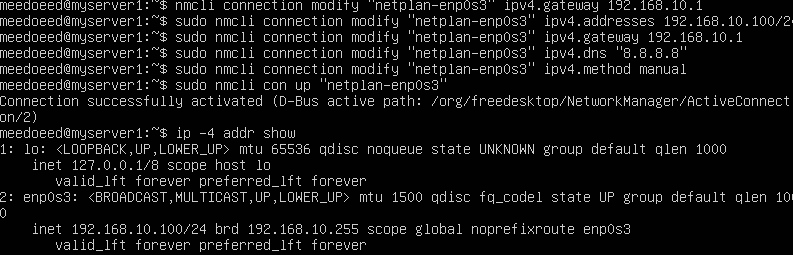
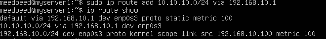
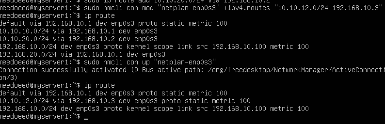
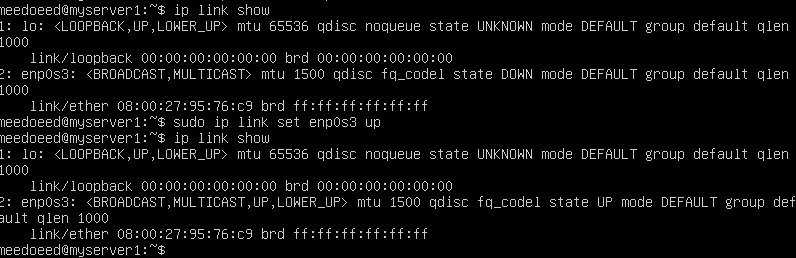
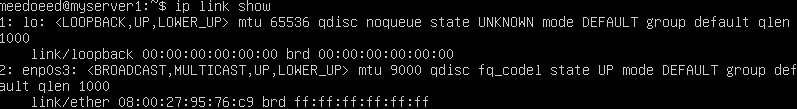

# Linux и сетевая инженерия

## Изучено

1) Основные дисмтрибутивы Линукс для ЦОД
2) Разница между net-tools и iproute2
3) Вывод информации об IP интерфейса
4) Адреса IPv4 и маски подсети, широковещательные адреса

## Получены навыки и выполнены следующие задачи:

1) Назначение статического ip через утилиту nmcli 
В моём случае nmcli con show не давал вывода (команда не показывала никаких подключений) - nmcli device status показал в выводе, что ethernet интерофейс находится в состоянии unmanaged, а значит нетворк менеджер был запущен, но управлять интерфейсами не мог.
Решением была найдена команда nmcli device set enp0s3 managed yes и перезагрузка сервиса NetworkManager

Далее были выполнены команды 

Последняя - ip -4 addr show подтвердила успешное выставление статического ip адреса на интерфейсе

2) Рассчитаны параметры для сети 192.168.25.0/24

Результаты:
IP сети:           192.168.25.0
Маска (дес):       255.255.255.0
Маска (двоичная):  11111111 11111111 11111111 00000000 Широковещательный: 192.168.25.255
Первый узел:       192.168.25.1
Последний узел:    192.168.25.254
Проверка ipcalc:   совпало 

3) Добавление временного и постоянного маршрута

Добавил маршрут до сети 10.10.10.0/24 через шлюз 192.168.10.2
Также научился добавлять постоянные маршруты через nmcli con mod с флагом +

4) Научился включать/выключать сетевые интерфейсы
пользоваться ip link show - для того чтобы узнавать имена интерфейсов 
ip link set <name> down/up - для включения и выключения

5) в прошлом скрине видно - mtu для интерфейса 1500 - стандартная для eth, но в цод могут применяться и пакеты большего размера - например 9000 (jumbo-кадры). Я научился менять MTU
nmcli con mod + параметр 802-3-ethernet.mtu

Тут сразу потребовалось перезагружать интерфейс для обновления, как это делал в (4)

6) Ознакомился с интерактивным режимом работы с nmcli - nmcli connection edit type ethernet

# Сети по Олиферу

1) Изучил Token Ring и FDDI
2) Изучил достоинства и недостатки разделяемой среды
3) Изучил принцип работы коммутаторов Ethernet

# DevOps 

1) Ознакомился с моделью зрелости 

# Дополнительно

Писал продолжение цикла статей по net/http Go