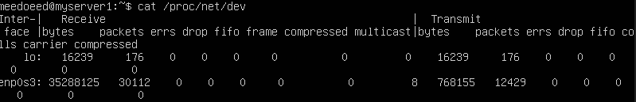
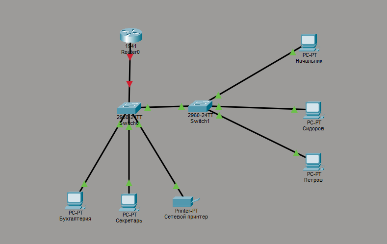
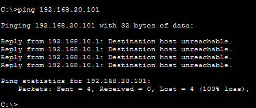

# Linux 

## ARP

arp -a 
Арп-таблица узла. Содержит IP-MAC-if
1) Посмотрел Arp-таблицу на своём узле, нашёл Ip, mac и на каком интерфейсе виден шлюз
В таблице есть записи по узлам, что я не пинговал потому что
- ответы на широковещательные запросы 
- мультикасты
- обнаружение соседей (мак-адреса других устройств отправлявших пакеты)
Слово [ether] означает тип канальной технологии на сетевом интерфейсе. Ether - ethernet
Время жизни записей в арп-таблицах на разных уровнях сетевых устройств может быть разным. У конечных узлов оно часто меньше коммутаторов и маршрутизаторов. Настроить время жизни записи можно в /proc/sys/net/ipv4/neigh/default/base_reachable_time_ms
На моём узле - 30 секунд
2) Очистить таблицу arp можно через
arp -d <адрес хоста>
а на cisco ios - clear arp - часто полезно
в моём случае после arp -d 10.0.2.2 (адрес шлюза) арп-таблица стала пустой
Запись на снова появилась при пинге google.com - практически мгновенно, как только первый ICMP-пакет готов к отправке - ОС смотрит в АРП-таблицу. Если записи нет - запрос отправляется в сеть и после получения ответа добавит запись в кэш (таблицу)
3) Добавил свою запись в ARP-таблицу через
sudo arp -i <if> -s <ip> <mac>
теперь при попытке стучаться на ip ОС сразу смотрит на АРП-таблицу и обращается на указанных mac
arp -a | grep <ip> - результат
Для удаления флаг -i требовался строго - без него Network Unreachable
4) Ознакомился с механизмом АРП-спуфинга путём
sudo arp -i eth0 -Ds 10.0.0.1 eth1 pub
Понял, что привязка к мак-адресу как ключ к безопасности - плохо
5) узнать мак адрес узла можно командой ip link show
Помимо интерфейса eth есть lo - виртуальный сетевой интерфейс
Это интерфейс - сам на себя без выхода. Самый яркий приер применения - обращение на localhost - тогда трафик не выходит в реальную сеть, а заварачивается через этот интерфейс на этот же узел.

## Файл proc и сетевая статистика 

1) cat /proc/net/dev - сетевая статистика по интерфейсам в терминале 

- здесь статистика по двум интерфейсам и видно
bytes - общее количество байт через интерфейс
packets - то же с пакетами
errs - количество ошибочых пакетов (не прошли CRC)
drop - количество пакетов отбрасываемых ОС
colls - коллизии - наверное, исторически осталось после разделённых сред с CSMA/CD, так как на сетях с коммутаторами всегда равно 0
старая утилита ifconfig имеет те же результаты, но в выводе менее удобна
ip -s link 
неполный вывод, не так подробно, но основное всё на месте bytes packets errors dropped missed mcast - для быстрой диагностики вполне подходит

2) Также в proc находится вышеупомянутое время жизни /proc/sys/net/ipv4/neigh/default/ здесь есть gc_stale_time время через которое сборщик мусора уберет строчку из ARP - таблицы.
Тут суть в default - это значение по умолчанию для всех интерфейсов, но можнео настроить и для конкретного интерфейса так
/proc/sys/net/ipv4/neigh/default/<if>
Внутри всё одно и то же 

# Cisco PT

Ситуационная задача
Описание офиса:

    Есть главный роутер (1941). Он смотрит в интернет (имитируем loopback 8.8.8.8) и в локальную сеть.

    В локальной сети два свитча (2960), соединённые между собой.

    К первому свитчу подключены:

        Компьютер Бухгалтера

        Компьютер Секретаря

        Сетевой принтер

    Ко второму свитчу подключены:

        Компьютер Инженера Петрова

        Компьютер Инженера Сидорова

        Компьютер Начальника

Дополнительная информация:

    Бухгалтер и Секретарь должны видеть принтер, но не должны видеть компьютеры инженеров.

    Инженеры должны видеть друг друга, но не должны видеть бухгалтерию.

    Начальник должен видеть всех (и бухгалтерию, и инженеров).

    Все компьютеры должны иметь доступ в интернет (через роутер).

Ход решения и мысли:

Поставил роутер - сразу прописал
interface loopback 0 
задал ip 8.8.8.8

Топология сети

Раздал ip на компьютеры и принтер

vlan10
Бухгалтерия - 192.168.10.100
Секретарь - 192.168.10.101
Принтер - 192.168.10.102

vlan30
Начальник - 192.168.30.100

vlan20
Сидоров - 192.168.20.101
Петров - 192.168.20.102

Доступ начальника ко всем организую через L3 маршрутизатор 

Настроил vlan на switch 1 - access порты к конечным узлам, trunk к роутеру и второму свичу
Настроил vlan на switch 1 - access порты к конечным узлам, trunk к первому свичу
Настроил gate 192.168.10.1 для принтера и прописал no shutdown на интерфейсе роутера

Пропинговал всех на отдельных вланах - всё работает
Бухгалтеры и секретарь помимо друг друга видят и принтер

Сделал три сабинтерфейса 0.10 0.20 и 0.30 на роутере 

Теперь все узлы могут пинговать друг друга и пинговать 8.8.8.8 (лупбэк на интернет для нас). Нужно ограничить видимость в рамках сети - настроить access-листы
Для меня они следующие: 
access-list 100 deny ip 192.168.10.0 0.0.0.255 192.168.20.0 0.0.0.255
access-list 100 deny ip 192.168.20.0 0.0.0.255 192.168.10.0 0.0.0.255
access-list 100 permit ip any any
после на роутере я отнес сабинтерфейсы 10 и 20 к этому access-list

Итог: с Бухгалтерии до Инженеров

Как и ожидалось не достучаться
Внутри vlan10 все могут друг до друга достучаться, как и ожидалось. Также они могут выходить на 8.8.8.8

Инженеры тоже могут пинговать друг друга и работать в Интернете

Начальник может пинговать все и работать в Интернете

Для меня это был хороший опыт решения практической задачи и новый опыт в реализации access-листов

## Литература

1) Linux для сетевых инженеров - прочитал главу по L2:Связь и между адресами IP и MAC адресами с помощью ARP.
Узнал о ряде инструментов и их функциях:

   arp - сегодня делал практику по главе с ним
    netplan
    telnet
    nc - усовершенствованный telnet

    и о приложениях

    nmap
    kismet
    wavemon
    linSSID

2) Олифер - изучил STP и RSTP - прочитал главу по скоростным версиям Ethernet