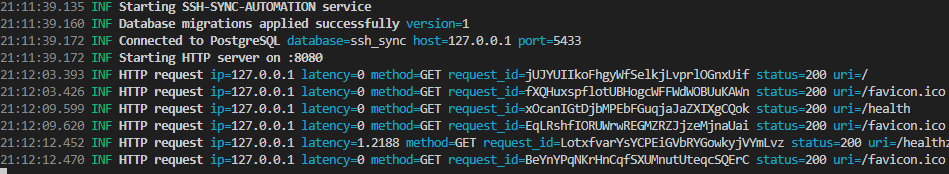

# Task закрыл Postgres

Сегодняшний и часть вчерашнего дня посвятил по большей части реализации pg слоя в сервисе. Сделано по итогу дня

1) Миграции. Здесь создана структура миграций в embedFS. Написана пара базовых миграций для сервиса. Также сделал автоматический запуск миграций при запуске сервиса.

2) Storage слой. Реализована структура DB с пулом соединений, инициализируемая согласно конфигу

3) Repository. Большую часть времени пришлось просидеть здесь. Созданы методы под Server_repo, server_status repo и task_repo. Суммарно было написано и покрыто реализациями 20 методов, поддерживающих CRUD для сервиса.

Обновил и добавил доменные сущности.
Server
Server status
SyncTask

По итогу тестил что получилось сделать с базой данных. Закрыл несколько TODO которые были с ней связаны.

Так как довольно долго сидел с кодом голова забилась и пришлось помучиться с дурацкой ошибкой - открывал docker pg для теста совместно с локальным pg на одном порту, из-за чего возникала проблема с конфлитом имен и паролей от бд.

Результаты интеграционного теста прилагаю здесь
В докере развернута голая БД postgres

Сервис показывает alive