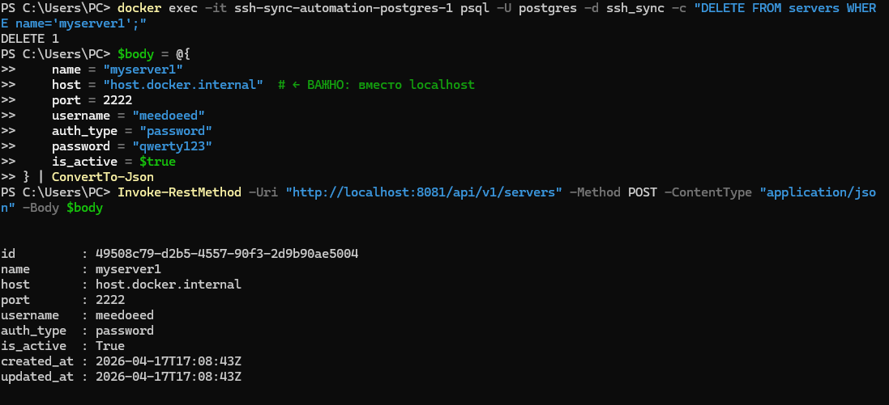
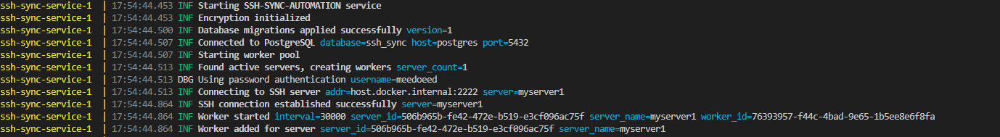
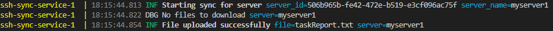
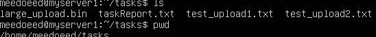
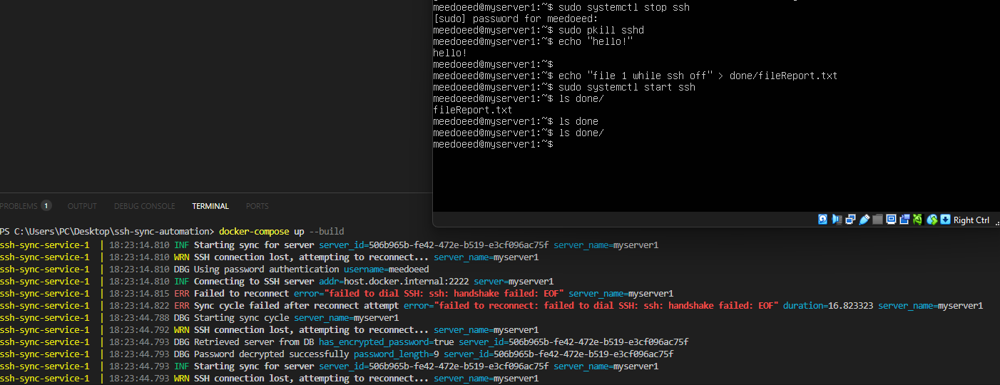

# Работа

После запуска сервиса в докер-контейнере он начинает функционировать сразу.

Развернул openssh на VM и отправил POST-запрос на сервис для внесения сервера в список к синхронизации

Сервер отвечает успехом, с этих пор начинается процесс синхронизации, который логируется в контейнере:

Заходим в терминал контейнера и заливаем туда файлы 

Я ради теста залил taskReport.txt

tasks/<server_name>/ необходимо создать самостоятельно. Как видите, файл создался и через время пропал самостоятельно. Давайте взглянем ан логи сервиса

Залогировалось успешное скачивание файла на сервер. Проверим

Здесь директория tasks создаётся полностью автоматически, в ней лежит наш файл с полным содержимым. 
Подобные результаты сервис показывает и при загрузке больших файлов разных расширений.
Успешно скачиваются и файлы и при обрыве соединения на половине скачивания. В таком случае на хосте сервиса создаётся .part файл и при повторном коннекте с сервером происходит докачка.

Давайте взглянем на то, может ли сервер реконнектиться 

На скрине видна и загрузка файла с сервера и повторное подключение к нему в случае отказа ввиду нестабильной среды

